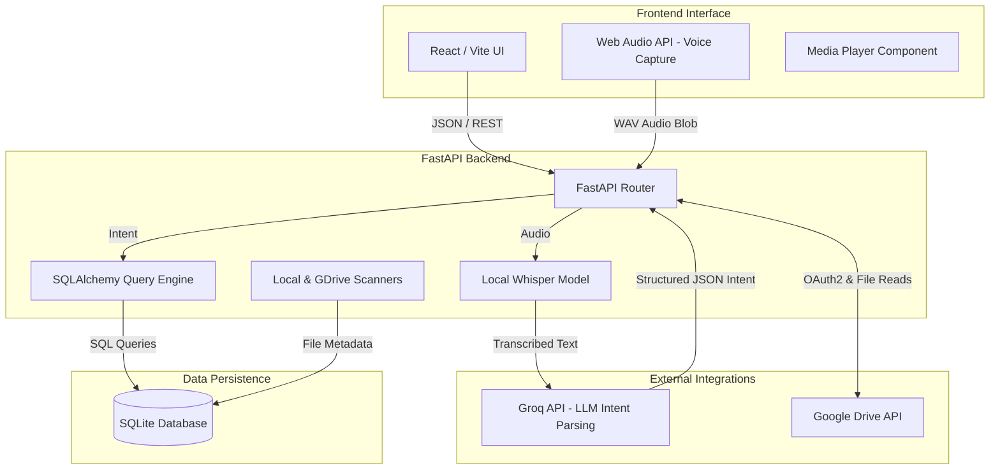

# Proposal: Smart Media Assistant (AI-Powered Media Management)

## 1. Executive Summary
The **Smart Media Assistant** is an intelligent, voice-activated media management platform designed to revolutionize how users interact with their media libraries. By integrating state-of-the-art Large Language Models (LLMs) via Groq, speech recognition, and seamless cloud integrations (Google Drive), the application provides a hands-free, intuitive, and highly responsive experience for querying, organizing, and playing media files (videos, images, audio).

## 2. Problem Statement & Objectives
### The Problem
Traditional file managers and media players rely on manual navigation, rigid folder structures, and keyword-based search. Users with large media libraries (both local and cloud-based) often struggle to quickly locate specific files, build playlists on the fly, or interact with their media seamlessly.

### Objectives
- **Frictionless Interaction:** Allow users to use natural language (voice commands) to find and control media.
- **Unified Media Access:** Seamlessly aggregate media from local machine folders and Google Drive into a single intelligent index.
- **Intelligent Intent Parsing:** Accurately understand complex, conversational requests (e.g., "Show me 3 short videos and 1 long video") using high-speed LLMs.
- **Modern User Experience:** Deliver a visually stunning, responsive, and dynamic web interface.

## 3. System Architecture
The system follows a decoupled Client-Server architecture, utilizing a React-based frontend and a FastAPI Python backend, backed by an SQLite database for high-performance querying.

## 4. Key Workflows

### 4.1 Voice Command Workflow
1. **Capture:** The user clicks the microphone button and speaks naturally. The frontend captures the audio blob and sends it to the backend.
2. **Transcription:** The backend uses the Whisper AI model to convert the audio into text instantly.
3. **Intent Parsing:** The transcribed text is sent to the **Groq API** (`llama-3.3-70b-versatile`) which parses the natural language into a highly structured JSON Intent payload using Pydantic models.
4. **Execution:** The Query Engine interprets the structured intent, queries the SQLite database for the relevant media, and returns the media URLs to the frontend.
5. **Playback:** The frontend UI automatically updates to display the media, initiate playback, or trigger specific UI states based on the intent.

### 4.2 Media Synchronization Workflow
1. **Local Scanning:** The user specifies a local directory. The backend recursively traverses the file system, categorizes files by type (audio, video, image) and subtype (short, long), and upserts the metadata into the database.
2. **Google Drive Integration:** 
   - The user clicks "Connect Google Drive", initiating a strict PKCE-secured OAuth 2.0 flow.
   - Upon authentication, the backend fetches an access token.
   - The `GDriveScanner` utilizes the Google API to query all compatible media files in the user's Drive, generating unified metadata and persisting it alongside local files.
   - Media streamed from Drive uses authenticated direct download URLs.

## 5. Technology Stack
- **Frontend:** React, Vite, TailwindCSS / Vanilla CSS, Framer Motion (for micro-animations), Lucide Icons.
- **Backend:** Python, FastAPI, SQLAlchemy, Uvicorn.
- **AI / ML Integration:** 
  - **LLM:** Groq Cloud API (Llama 3.3 70B) for lightning-fast intent parsing.
  - **Speech-to-Text:** OpenAI Whisper (Local inference).
- **Integrations:** Google Drive API (OAuth 2.0 via `google-auth-oauthlib`).
- **Database:** SQLite (Lightweight, embedded, highly performant for local indexing).

## 6. Implementation Phases

- **Phase 1: Foundation (Completed)**
  - Scaffold FastAPI backend and React frontend.
  - Establish SQLite database schema for unified media models.
- **Phase 2: Core Intelligence (Completed)**
  - Integrate Whisper for audio transcription.
  - Integrate Groq API with strict Pydantic JSON schema output for intent parsing.
  - Implement query engine for structured media retrieval (e.g., "short vs long" logic).
- **Phase 3: Integrations & Polish (Completed)**
  - Implement local filesystem scanning.
  - Implement Google Drive OAuth 2.0 and recursive cloud scanning.
  - Finalize dynamic frontend UI with sleek dark-mode aesthetics.
- **Phase 4: Future Enhancements (Proposed)**
  - Add facial recognition and object detection to index content within images/videos.
  - Implement cloud-based database syncing for multi-device support.
  - Add native desktop application packaging (Electron / Tauri).

## 7. Conclusion
The Smart Media Assistant successfully bridges the gap between static media libraries and conversational AI. By treating natural language as a first-class control mechanism and seamlessly merging cloud and local storage, it offers a deeply intuitive, next-generation media consumption experience.
